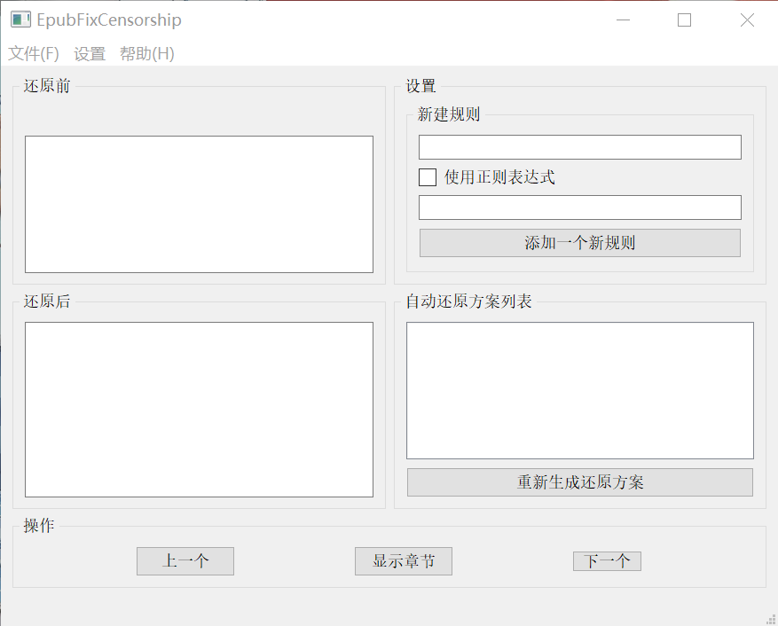

# EpubFixCensorship
### 介绍
一个用于将epub中被错误屏蔽屏蔽的敏感词还原回来的工具。  
如，`**控`可以被还原为`被操控`，`一次**给`可以被还原为`一次性交给`。  
这些句子本身没有任何问题，只是因为很多网站对于色情词汇的处理太过于简单粗暴而被误封，本工具旨在尽量快速方便地还原这些被错误屏蔽的句子。  

### 特性
- 支持通过正则表达式规则来还原句子
- 支持记录曾被还原的段落，当再次遇到一样的段落时自动使用上次还原的结果。

### 计划中的特性
- 命令行版本以方便批量处理
- 云端规则库

### 截图

### 依赖模块
- PyQt5
- cssselect
- lxml
- ebooklib
- regex (可选，如果没有的话会调用python内置的re模块)

### 构建
使用`build.sh`会产生一个`build`文件夹将所有需要的文件复制过去，并自动从git获取版本号直接写入到`build`中的`version.py`供程序读取。未经过这个处理的话`version.py`原本的代码是自动从git中获取版本号。  
使用`build_windows.bat`会产生一个`build_windows`文件夹并将使用pyinstaller打包好的exe放进去。  
这两个脚本都会顺便将README.md、LICENSE放进对应的build文件夹中，顺便还会将rules.json也放进去，虽然没有这个文件也行，不过这里顺便提供了我自用的规则文件，以后这个文件应该还会更新变得越来越完善。  
